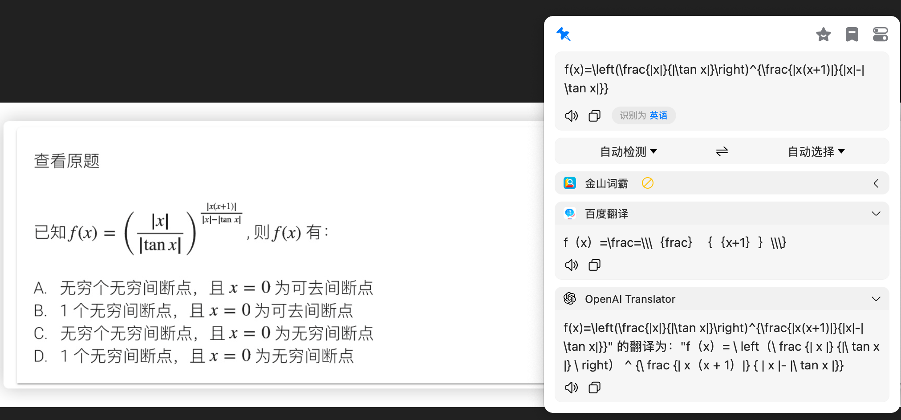

# bob-plugin-simpletex-ocr

> 利用simpletex的api接口实现latex公式识别

## 1.使用教程

1. 请查询如何使用bob
   https://v0.bobtranslate.com/
2. 请查询如何申请simpletex的api
   https://simpletex.cn/api
3. 将api填入设置中token处

## 2.温馨提示

本工具仅识别latex公式所用，请勿滥用识别文字
## 3.识别效果

